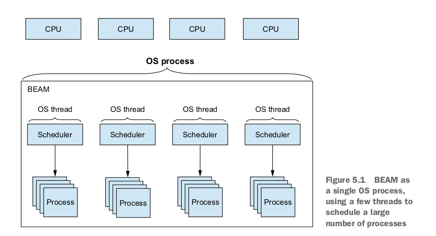

# Algorithms, models and concepts in distributed systems
Coursework for the AMCDS subject.

## Notes

### Abstract API notions used in the book

```
                                                  ▲
       │                                          │
       │                                          │
       │                                          │
       │                                          │
       │                                          │
       │                                          │
┌──────▼──────────────────────────────────────────┴───┐
│   send                                    deliver   │
│                                                     │
│                                                     │
│                                                     │
│                                                     │
│                      Layer n                        │
│                                                     │
│                                                     │
│                                                     │
│                                                     │
│                                                     │
│ invoke                                   receive    │
└──────┬──────────────────────────────────────────▲───┘
       │                                          │
       │                                          │
       │                                          │
       │                                          │
       │                                          │
       │                                          │
       ▼                                          │
```


### Types of distributed algorithms

1. fail-stop algorithms, designed under the assumption that processes can fail by crashing but the crashes can be reliably detected by all the other processes;

2. fail-silent algorithms, where process crashes can never be reliably detected;

3. fail-noisy algorithms, where processes can fail by crashing and the crashes can be detected, but not always in an accurate manner (accuracy is only eventual);

4. fail-recovery algorithms, where processes can crash and later recover and still participate in the algorithm;

5. fail-arbitrary algorithms, where processes can deviate arbitrarily from the protocol specification and act in malicious, adversarial ways; and

6. randomized algorithms, where in addition to the classes presented so far, processes may make probabilistic choices by using a source of randomness.

### Types of processes

1. faulty process &rarr; a process that stops executing computations at a specific time t

2. correct process &rarr; a process which never crashes and executes an infinite number of steps 

### Types of faults 

1. Crashes &rarr; occurs when a process stops executing computations after a time t
2. Ommisions &rarr; occurs when a process does not send a message that is supposed to send 
3. Crashes with recoveries &rarr; occurs when a process crashes and stops but recovers later
4. Eavesdropping faults &rarr; occur when a process leaks information obtained in an algorithm by an outside entity and can be prevented by cryptography (encrypting communication messages and stored data)
5. Arbitrary faults &rarr; occur when a process deviates in any conceivable way from the algorithm assigned to it (the most general fault behaviour, is synonymous with the term "byzantine" referring to the byzantine problem)

### Types of links 
1. fair-loss links &rarr; capture the basic idea that messages might be lost but the probability for a message not to be lost is non-zero (weakest variant)

```
Module:
	Name: FairLossPointToPointLinks, instance fll.

Events:
	Request: <fll, Send | q, m>: Requests to send message m to process q.
	Indication: <fll, Deliver | p, m>: Delivers message m sent by process p.

Properties:
	FLL1: Fair-loss: If a correct process p infinitely often sends a message m to a correct process q, then q delivers m an infinite number of times.
	FLL2: Finite duplication: If a correct process p sends a message m a finite number of times to process q, then m cannot be delivered an infinite number of times by q.
	FLL3: No creation: If some process q delivers a message m with sender p, then m was previously sent to q by process p
```

2. stubborn links &rarr; links that hide the lower-layer retransmission mechanisms used by the sender process, when using fair-loss links, to make sure its messages are eventually delivered (received) by the destination process

```
Module:
	Name: StubbornPointToPointLinks, instance sl.

Events:
	Request: <sl, Send | q, m>: Requests to send message m to process q.
	Indication: <sl, Deliver | p, m>: Delivers message m sent by process p.

Properties:
	SL1: Stubborn delivery: If a correct process p sends a message m once to a correct process q, then q delivers m an infinite number of times.
	SL2: No creation: If some process q delivers a message m with sender p, then m was previously sent to q by process p
```

:exclamation: see page 35-36 for the "Retransmit Forever" algorithm containing an implementation of a stubborn link over a fair-loss link

3. perfect links &rarr; links containing both message duplicates detection and mechanisms for message retransmission (also called the reliable links abstraction)

```
Module:
	Name: PerfectPointToPointLinks, instance pl.

Events:
	Request: <pl, Send | q, m>: Requests to send message m to process q.
	Indication: <pl, Deliver | p, m>: Delivers message m sent by process p.

Properties:
		PL1: Reliable delivery: If a correct process p sends a message m to a correct process q, then q eventually delivers m.
		PL2: No duplication: No message is delivered by a process more than once.
		PL3: No creation: If some process q delivers a message m with sender p, then m was previously sent to q by process p.
```

:exclamation: see page 38 for the "Eliminate Duplicates" algorithm containing an implementation of a perfect point-to-point link instance 

### Failure detection
- provides information about which processes have crashed and which are correct, with this information not being necessarily accurate (not very useful against Byzantine faults) 

1. Perfect Failure Detection

```
Module:
	Name: PerfectFailureDetector, instance P. 
Events:
	Indication: ⟨ P, Crash | p ⟩: Detects that process p has crashed. 
Properties:
	PFD1: Strong completeness: Eventually, every process that crashes is permanently detected by every correct process.
	PFD2: Strong accuracy: If a process p is detected by any process, then p has crashed.
```

:exclamation: see page 51 for the "Exclude On Timeout" algorithm containing an implementation of a perfect failure detector 

2. Leader election
- useful when instead of detecting each failed process, we have to identify one process that has not failed
- can only be formulated for crash-stop process abstractions

```
Module:
	Name: LeaderElection, instance le. 

Events:
	Indication: ⟨ le, Leader | p ⟩: Indicates that process p is elected as leader. 

Properties:
	LE1: Eventual detection: Either there is no correct process, or some correct process is eventually elected as the leader.
	LE2: Accuracy: If a process is leader, then all previously elected leaders have crashed.
```

:exclamation: see page 53 for the "Monarchical Leader Election" algorithm containing an implementation of a leader election abstraction assuming a perfect failure detector

3. Eventually Perfect Failure Detector
- keeps track of processes that are "suspected" to have failed (instead of tracking failed processes)
- uses a timeout
- p increases its delay if it eventually receives a message from the "suspected" process q 

```
Module:
	Name: EventuallyPerfectFailureDetector, instance QP. 

Events:
	Indication: ⟨ QP , Suspect | p ⟩: Notifies that process p is suspected to have crashed.
	Indication: ⟨ QP, Restore | p ⟩: Notifies that process p is not suspected anymore. 

Properties:
	EPFD1: Strong completeness: Eventually, every process that crashes is perma- nently suspected by every correct process.
	EPFD2: Eventual strong accuracy: Eventually, no correct process is suspected by any correct process.
```

### Reliable broadcast

```
Module:
		Name: ReliableBroadcast, instance rb.

Events:
		Request: <rb, Broadcast | m>: Broadcasts a message m to all processes.
		Indication: <rb, Deliver | p, m>: Delivers a message m broadcast by process p.

Properties:
		RB1: Validity: If a correct process p broadcasts a message m, then p eventually delivers m.
		RB2: No duplication: No message is delivered more than once.
		RB3: No creation: If a process delivers a message m with sender s, then m was previously broadcast by process s.
		RB4: Agreement: If a message m is delivered by some correct process, then m is eventually delivered by every correct process.
```

eexclamation: see page 78 for the "Fail-stop" algorithm 

### Resilience
- the relation between the number f of potentially faulty processes and the total number N of processes in the system

## [Elixir scheduler inner workings (page 161)](https://www.manning.com/books/elixir-in-action-second-edition)

"Each BEAM scheduler is in reality an OS thread that manages the execution of BEAM processes. By default, BEAM uses only as many schedulers as there are logical processors available. You can change these settings via various Erlang emulator flags. To provide those flags, you can use the following syntax:

```$ iex --erl "put Erlang emulator flags here"```

A list of all Erlang flags can be found at http://erlang.org/doc/man/erl.html. In general, you can assume that there are n schedulers that run m processes, with m most often being significantly larger than n. This is called m:n threading, and it reflects the fact that you run a large number of logical microthreads using a smaller number of OS threads, as illustrated in figure 5.4.



Internally, each scheduler maintains a run queue, which is something like a list of BEAM processes it’s responsible for. Each process gets a small execution window, after which it’s preempted and another process is executed. The execution window is approximately 2,000 function calls (internally called reductions). Because you’re dealing with a functional language where functions are very small, it’s clear that context switching happens often, generally in less than 1 millisecond. 

This promotes the responsiveness of BEAM powered systems. If one process performs a long CPU-bound operation, such as computing the value of pi to a billion decimals, it won’t block the entire scheduler, and other processes shouldn’t be affected. 

There are some special cases when a process will implicitly yield execution to the scheduler before its execution time is up. The most notable situation is when using receive. Another example is a call to the *:timer.sleep/1* function. In both cases, the process is suspended, and the scheduler can run other processes. 

Another important case of implicit yielding involves I/O operations, which are internally executed on separate threads called async threads. When issuing an I/O call, the calling process is preempted, and other processes get the execution slot. After the I/O operation finishes, the scheduler resumes the calling process. A great benefit of this is that your I/O code looks synchronous, while under the hood it still runs asynchronously. By default, BEAM fires up 10 async threads, but you can change this via the *+A n* Erlang flag. 

Additionally, if your OS supports it, you can rely on a kernel poll such as epoll or kqueue, which takes advantage of the OS kernel for nonblocking I/O. You can request the use of a kernel poll by providing the *+K true* Erlang flag when you start the BEAM. 
Implicit yields provide additional benefits. If most processes are suspended most of the time — for example, while the kernel is doing I/O or while many processes are waiting for messages — BEAM schedulers are even more efficient and have bigger overall throughput."


## Resources

- [Introduction to Reliable and Secure Distributed Programming - Christian Cachin, Rachid Guerraoui, Luís Rodrigues](https://www.google.com/url?sa=t&rct=j&q=&esrc=s&source=web&cd=&ved=2ahUKEwiB06H688L9AhVriv0HHd5QCNQQFnoECAgQAQ&url=https%3A%2F%2Fa8779-2401331.cluster15.canvas-user-content.com%2Fcourses%2F8779~17212%2Ffiles%2F8779~2401331%2Fcourse%2520files%2FIntroduction%2520to%2520Reliable%2520and%2520Secure%2520Distributed%2520Second%2520Edition%25202.pdf%3Fdownload_frd%3D1&usg=AOvVaw0ojQGVoV5Cz7TnFPEkx0z2)

- [Elixir - concurrency](https://manzanit0.github.io/elixir/2019/09/29/elixir-concurrency.html)

- [Cooperative vs. preemptive scheduling](https://stackoverflow.com/questions/55703365/what-is-the-difference-between-cooperative-multitasking-and-preemptive-multitask)

- [What are protocol buffers?](https://medium.com/javarevisited/what-are-protocol-buffers-and-why-they-are-widely-used-cbcb04d378b6)

- [elixir-protobuf](https://github.com/elixir-protobuf/protobuf)

- [Async TCP client/server in Elixir](https://elixirforum.com/t/async-tcp-client-server/25202/2)

- [Dangers of GenServers in Elixir](https://learn-elixir.dev/blogs/dangers-of-genservers)

- [Elixir - GenServer call not initiating handle_call](https://stackoverflow.com/questions/46510137/elixir-genserver-call-not-initiaing-handle-call)

- [Handling TCP connections in Elixir](https://andrealeopardi.com/posts/handling-tcp-connections-in-elixir/)

- [Erlang and OTP in action](https://m.blog.naver.com/PostView.naver?isHttpsRedirect=true&blogId=oidoman&logNo=220545018500)

- [Communicating Sequential Processes vs. Actor model](https://dev.to/karanpratapsingh/csp-vs-actor-model-for-concurrency-1cpg)

- [Learn you some Erlang - Sockets](https://learnyousomeerlang.com/buckets-of-sockets)

- [Non-blocking TCP server using OTP principles](https://stackoverflow.com/questions/6170613/non-blocking-tcp-server-using-otp-principles)

- [Non-blocking IO - Elixir](https://elixirforum.com/t/non-blocking-io/376/8)

- [What OTP pattern to use for gen_server socket broadcast?](https://stackoverflow.com/questions/24974170/what-otp-pattern-to-use-for-gen-server-socket-broadcast)

- [How can the packet option of socket in Erlang accelerate the TCP transmission?](https://stackoverflow.com/questions/13878587/how-can-the-packet-option-of-socket-in-erlang-accelerate-the-tcp-transmission)

- [How is a process in Elixir different from system threads in other languages?](https://elixirforum.com/t/how-is-process-in-elixir-different-with-system-thread-in-other-language/28076)

- [Why is data deep-copied when sending it to another process?](https://elixirforum.com/t/why-is-data-deep-copied-when-sending-to-another-process/26330)
