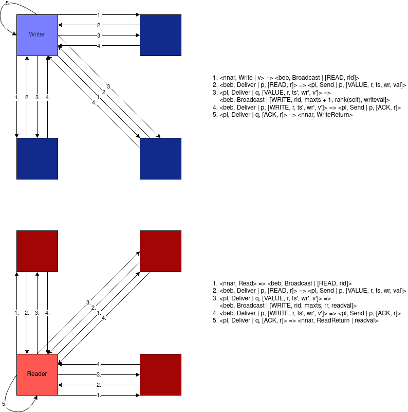
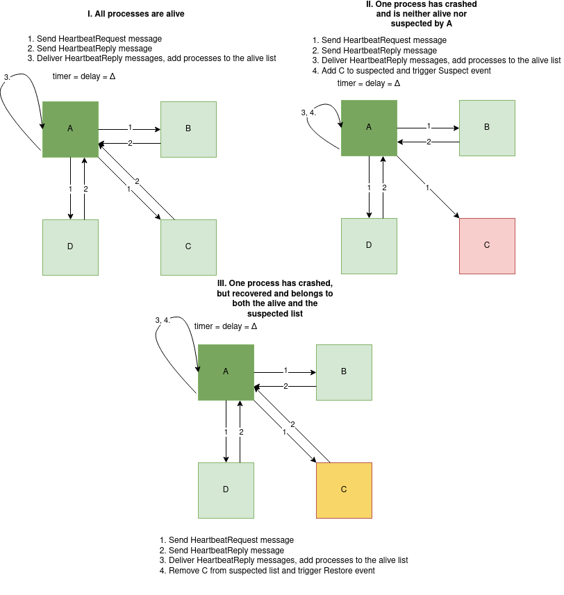
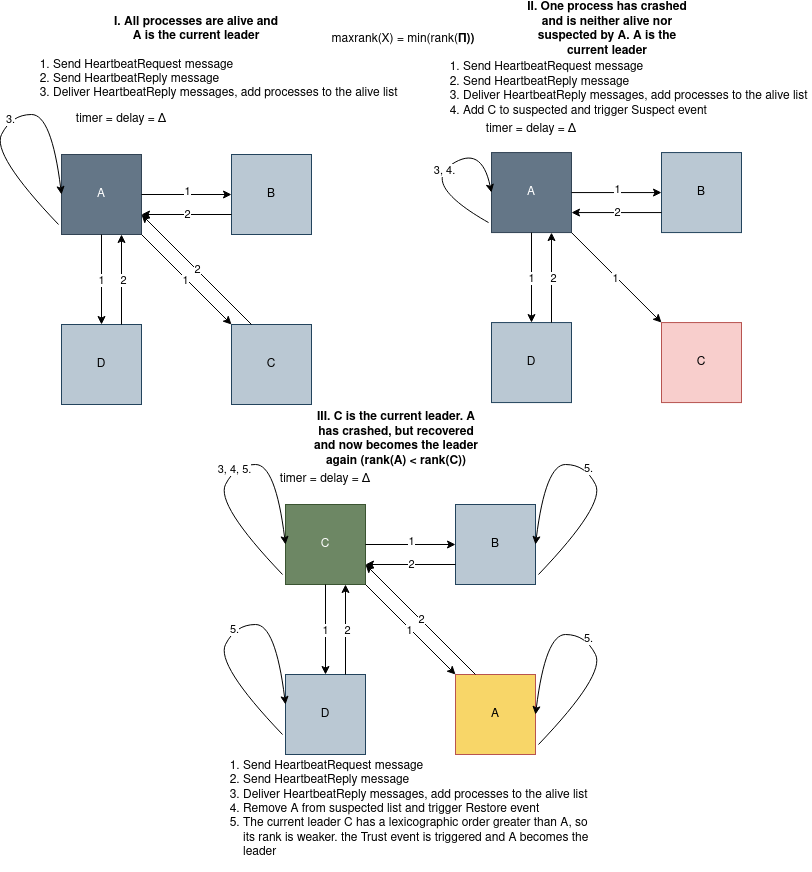
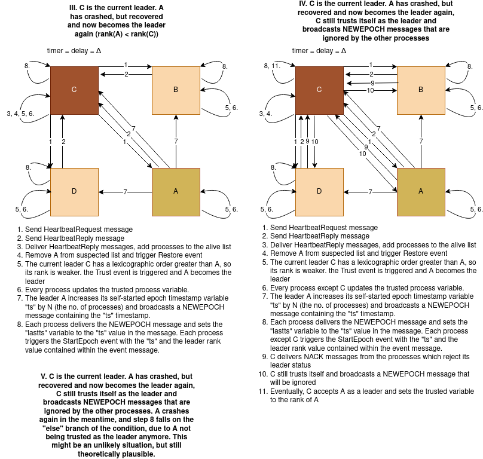
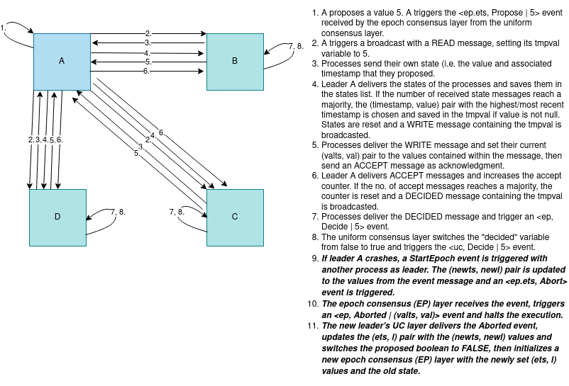

# Algorithms, models and concepts in distributed systems
Coursework for the AMCDS subject.

## Notes

### Abstract layer notions used in the book


### Types of distributed algorithms

1. fail-stop algorithms, designed under the assumption that processes can fail by crashing but the crashes can be reliably detected by all the other processes;

2. fail-silent algorithms, where process crashes can never be reliably detected;

3. fail-noisy algorithms, where processes can fail by crashing and the crashes can be detected, but not always in an accurate manner (accuracy is only eventual);

4. fail-recovery algorithms, where processes can crash and later recover and still participate in the algorithm;

5. fail-arbitrary algorithms, where processes can deviate arbitrarily from the protocol specification and act in malicious, adversarial ways; and

6. randomized algorithms, where in addition to the classes presented so far, processes may make probabilistic choices by using a source of randomness.

### Types of processes

1. faulty process &rarr; a process that stops executing computations at a specific time t

2. correct process &rarr; a process which never crashes and executes an infinite number of steps 

### Types of faults 

1. Crashes &rarr; occurs when a process stops executing computations after a time t
2. Ommisions &rarr; occurs when a process does not send a message that is supposed to send 
3. Crashes with recoveries &rarr; occurs when a process crashes and stops but recovers later
4. Eavesdropping faults &rarr; occur when a process leaks information obtained in an algorithm by an outside entity and can be prevented by cryptography (encrypting communication messages and stored data)
5. Arbitrary faults &rarr; occur when a process deviates in any conceivable way from the algorithm assigned to it (the most general fault behaviour, is synonymous with the term "byzantine" referring to the byzantine problem)

### Types of links 
1. fair-loss links &rarr; capture the basic idea that messages might be lost but the probability for a message not to be lost is non-zero (weakest variant)

```
Module:
	Name: FairLossPointToPointLinks, instance fll.

Events:
	Request: <fll, Send | q, m>: Requests to send message m to process q.
	Indication: <fll, Deliver | p, m>: Delivers message m sent by process p.

Properties:
	FLL1: Fair-loss: If a correct process p infinitely often sends a message m to a correct process q, then q delivers m an infinite number of times.
	FLL2: Finite duplication: If a correct process p sends a message m a finite number of times to process q, then m cannot be delivered an infinite number of times by q.
	FLL3: No creation: If some process q delivers a message m with sender p, then m was previously sent to q by process p
```

2. stubborn links &rarr; links that hide the lower-layer retransmission mechanisms used by the sender process, when using fair-loss links, to make sure its messages are eventually delivered (received) by the destination process

```
Module:
	Name: StubbornPointToPointLinks, instance sl.

Events:
	Request: <sl, Send | q, m>: Requests to send message m to process q.
	Indication: <sl, Deliver | p, m>: Delivers message m sent by process p.

Properties:
	SL1: Stubborn delivery: If a correct process p sends a message m once to a correct process q, then q delivers m an infinite number of times.
	SL2: No creation: If some process q delivers a message m with sender p, then m was previously sent to q by process p
```

:exclamation: see page 35-36 for the "Retransmit Forever" algorithm containing an implementation of a stubborn link over a fair-loss link

3. perfect links &rarr; links containing both message duplicates detection and mechanisms for message retransmission (also called the reliable links abstraction)

```
Module:
	Name: PerfectPointToPointLinks, instance pl.

Events:
	Request: <pl, Send | q, m>: Requests to send message m to process q.
	Indication: <pl, Deliver | p, m>: Delivers message m sent by process p.

Properties:
		PL1: Reliable delivery: If a correct process p sends a message m to a correct process q, then q eventually delivers m.
		PL2: No duplication: No message is delivered by a process more than once.
		PL3: No creation: If some process q delivers a message m with sender p, then m was previously sent to q by process p.
```

:exclamation: see page 38 for the "Eliminate Duplicates" algorithm containing an implementation of a perfect point-to-point link instance 

### Failure detection
- provides information about which processes have crashed and which are correct, with this information not being necessarily accurate (not very useful against Byzantine faults) 

1. Perfect Failure Detection

```
Module:
	Name: PerfectFailureDetector, instance P. 
Events:
	Indication: ⟨ P, Crash | p ⟩: Detects that process p has crashed. 
Properties:
	PFD1: Strong completeness: Eventually, every process that crashes is permanently detected by every correct process.
	PFD2: Strong accuracy: If a process p is detected by any process, then p has crashed.
```

:exclamation: see page 51 for the "Exclude On Timeout" algorithm containing an implementation of a perfect failure detector 

2. Leader election
- useful when instead of detecting each failed process, we have to identify one process that has not failed
- can only be formulated for crash-stop process abstractions

```
Module:
	Name: LeaderElection, instance le. 

Events:
	Indication: ⟨ le, Leader | p ⟩: Indicates that process p is elected as leader. 

Properties:
	LE1: Eventual detection: Either there is no correct process, or some correct process is eventually elected as the leader.
	LE2: Accuracy: If a process is leader, then all previously elected leaders have crashed.
```

:exclamation: see page 53 for the "Monarchical Leader Election" algorithm containing an implementation of a leader election abstraction assuming a perfect failure detector

3. Eventually Perfect Failure Detector
- keeps track of processes that are "suspected" to have failed (instead of tracking failed processes)
- uses a timeout
- p increases its delay if it eventually receives a message from the "suspected" process q 

```
Module:
	Name: EventuallyPerfectFailureDetector, instance QP. 

Events:
	Indication: ⟨ QP , Suspect | p ⟩: Notifies that process p is suspected to have crashed.
	Indication: ⟨ QP, Restore | p ⟩: Notifies that process p is not suspected anymore. 

Properties:
	EPFD1: Strong completeness: Eventually, every process that crashes is perma- nently suspected by every correct process.
	EPFD2: Eventual strong accuracy: Eventually, no correct process is suspected by any correct process.
```

### Reliable broadcast

```
Module:
		Name: ReliableBroadcast, instance rb.

Events:
		Request: <rb, Broadcast | m>: Broadcasts a message m to all processes.
		Indication: <rb, Deliver | p, m>: Delivers a message m broadcast by process p.

Properties:
		RB1: Validity: If a correct process p broadcasts a message m, then p eventually delivers m.
		RB2: No duplication: No message is delivered more than once.
		RB3: No creation: If a process delivers a message m with sender s, then m was previously broadcast by process s.
		RB4: Agreement: If a message m is delivered by some correct process, then m is eventually delivered by every correct process.
```

:exclamation: see page 78 for the "Fail-stop" algorithm 

### (1, N) regular register

- one specific process p can invoke a write operation on the register, and any process can invoke a read operation on the register
- the notion of regularity is not considered for multiple writers
- Every read operation that is not concurrent with any write operation returns the last value written. If there is a concurrent write, the read is allowed to return the last value written or the value concurrently being written. Note that if a process invokes a write and crashes (without recovering), the write is considered to be concurrent with any read that did not precede it. Hence, such a read can return the value that was supposed to be written by the failed write or the last value written before the failed write was invoked. In any case, the returned value must be read from some write operation invoked on the register. That is, the value returned by any read operation must be a value that some process has tried to write (even if the write was not complete), and it cannot be invented out of thin air. The value may be the initial value ⊥ of the register.
- doesn't ensure atomicity and linearizability

```
Module:
	Name: (1, N)-RegularRegister, instance onrr.

Events:
	Request: <onrr, Read>: Invokes a read operation on the register.
	Request: <onrr, Write | v>: Invokes a write operation with value v on the register.
	Indication: <onrr, ReadReturn | v>: Completes a read operation on the register
	with return value v.
	Indication: <onrr, WriteReturn>: Completes a write operation on the register.

Properties:
	ONRR1: Termination: If a correct process invokes an operation, then the operation
	eventually completes.
	ONRR2: Validity: A read that is not concurrent with a write returns the last value
	written; a read that is concurrent with a write returns the last value written or the
	value concurrently written.
```

:exclamation: see page 144 for the "Read-One Write-All" regular register
:exclamation: see page 146 for the "Majority-voting" regular register 

### (1, N) atomic register

- A (1, N) atomic register is a regular register that, in addition to the properties of a regular register ensures a specific ordering property
- to ensure atomicity and linearizability, the local read of (1, N) regular register is transformed into a global read, which leads to the (1, N) atomic register abstraction that circumvents the problem by having the reader also impose the value it is about to return on all other processes. In other words, the read operation also writes back the value that it is about to return. This modification is described as Algorithm 4.5, called "Read-Impose Write-All". The writer uses a timestamp to distinguish the values it is writing, which ensures the ordering property of every execution. A process that is asked by another process to store an older value than the currently stored value does not modify its memory. 
The algorithm uses a request identifier *rid* distinguishes among WRITE messages that belong to different reads or writes. A flag *reading* used during the writing part distinguishes between the write operations and the write-back part of the read operations.
- for the fail-silent model, the read is also imposed by writing the value to all other processes. However, the reader actually selects the value with the largest timestamp from a majority and only afterwards imposes that value making sure that a majority adopts it before completing the read operation: this ensures the ordering property of an atomic register. (Read-Impose Write-Majority).

```
Module:
	Name: (1, N)-AtomicRegister, instance onar.

Events:
	Request: <onar, Read>: Invokes a read operation on the register.
	Request: <onar, Write | v>: Invokes a write operation with value v on the register.
	Indication: <onar, ReadReturn | v>: Completes a read operation on the register with return value v.
	Indication: <onar, WriteReturn>: Completes a write operation on the register.

Properties:
	ONAR1–ONAR2: Same as properties ONRR1–ONRR2 of a (1, N) regular register
	ONAR3: Ordering: If a read returns a value v and a subsequent read returns a
	value w, then the write of w does not precede the write of v.
```

### (N, N) atomic register 

An (N, N) atomic register abstraction (NNAR) links together read and write operations in a stricter way than its single-writer relative. This register abstraction ensures that every failed write appears either as if it was never invoked or as if it completed, i.e., as if the operation was invoked and terminated. Clearly, a failed read operation may always appear as if it was never invoked. In addition, even in the face of concurrency, it must be that the values returned by reads could have been returned by a hypothetical serial execution, where every operation takes place at an indivisible point in time, which lies between the invocation event and the completion event of the operation. An (N, N) atomic register is a strict generalization of a (1, N) atomic register in the sense that every execution of a (1, N) atomic register is also an execution of an (N, N) atomic register but not vice versa.

The hypothetical serial execution mentioned before is called a linearization of the actual execution. More precisely, a linearization of an execution is defined as a sequence of complete operations that appear atomically, one after the other, which contains at least all complete operations of the actual execution (and possibly some operations that were incomplete) and satisfies the following conditions:

1. every read returns the last value written; and
2. for any two operations o and o', if o precedes o' in the actual execution, then o also appears before o' in the linearization.

We call an execution linearizable if there is a way to linearize it like this. With this notion, one can reformulate the atomicity property of an (N, N) atomic register as:
```
	NNAR2’: Atomicity: Every execution of the register is linearizable.
```

To implement (N, N) atomic registers, we adopt the same modular approach as for implementing (1, N) atomic registers. 
In order to get an idea of the issue introduced by multiple writers, it is important to first figure out why the “Read-Impose Write-All” algorithm cannot afford multi- ple writers. Consider indeed two processes p and q trying to write concurrently to a register, implemented using the “Read-Impose Write-All” algorithm. Due to the use of acknowledgments for read and write operations, if the preceding operation completed and no other operation is invoked, processes p and q both store the same timestamp ts used by that operation. When they proceed to write, different values would become associated with the same timestamp. To resolve this issue, the algorithm also stores the identity of the process that writes a value together with a timestamp, expressed through the writer’s rank, and uses it to determine the highest timestamp. Comparisons employ the same ordering of timestamp/rank pairs as in Algorithm 4.8. Apart from the addition of writer-ranks and the modified comparison, the fail-stop algorithm is the same as "Read-Impose Write-All" (1,N) atomic register.

The fail-silent model is derived from the "Read-Impose Write-Majority" (1, N)-atomic algorithm. Suppose a process p executes a long sequence of write operations. Furthermore, assume that some other correct process q has not received the WRITE messages from p so far, and was, therefore, never included in the majority required to complete those operations. When process q tries to write using its local timestamp, its write operation will fail because its timestamp is smaller than the current value stored by those processes that acknowledged the write operations of p. Compared to the discussion of Algorithm 4.9 before, which uses the fail-stop model, the timestamp of q can fall behind much more here, because q’s reply is not needed by p to terminate an operation. For extending the “Read-Impose Write-Majority” algorithm to multiple writers, we have to determine the “current” timestamp in a distributed fashion. Every writer first consults all processes for timestamps written by other processes, determines the maximal timestamp stored so far, and then selects a higher timestamp to be associated with its write operation. The consultation phase reads the distributed atomic register in the same way as during a read operation. The read operation of the (N, N) atomic register algorithm is similar to the single-writer algorithm. The write operation is different in that the writer first invokes the mechanism of the read operation to determine a timestamp to associate with the new value. As in the other multi-writer register algorithms, the algorithm extends timestamps by the rank of the writer process for determining the value to store. Process p determines the value with the highest timestamp/rank pair, ordered first by timestamp and second by rank. This defines a total order among the values stored in the underlying registers. We abstract away this order within the function *highest(·)*, which we modify for this algorithm so that it operates on triples of the form *(timestamp, rank, value)* and returns the timestamp and value from the triple with the largest timestamp/rank pair in our total order. The variable *readlist* is a length-N list of timestamp/value pairs; 

```
Module:
	Name: (N, N)-AtomicRegister, instance nnar.

Events:
	Request: <nnar, Read>: Invokes a read operation on the register.
	Request: <nnar, Write | v>: Invokes a write operation with value v on the register.
	Indication: <nnar, ReadReturn | v>: Completes a read operation on the register
	with return value v.
	Indication: <nnar, WriteReturn>: Completes a write operation on the register.

Properties:
	NNAR1: Termination: Same as property ONAR1 of a (1, N) atomic register
	NNAR2: Atomicity: Every read operation returns the value that was written most
	recently in a hypothetical execution, where every failed operation appears to be
	complete or does not appear to have been invoked at all, and every complete ope-
	ration appears to have been executed at some instant between its invocation and its
	completion.
```



Write operation flow:

1. Hub sends a WRITE [register_name] [value] to a "leader" process [owner-rank]
2. [owner-rank] creates the register with the given name if it does not exist and then broadcasts a READ [operation_id] to all the other processes to get the timestamps from them, setting the abstraction ID destination to be app.nnar[register_name].
3. The processes deliver the READ and send the most recent value associated with [register_name] (which will be created if it does not exist yet) specified in the abstraction ID back to the "leader process"
4. The "leader process" delivers the value, saves it in the register's readlist and broadcasts a WRITE [operation_id] [maxts+1] [rank(self)] [writeval] to the other processes with a timestamp higher than the maximum available timestamp.
5. The processes deliver the written value, saving it and then sending back an acknowledgment to the "leader process"
6. The leader delivers the acknowledgments and sends a WRITERETURN to the hub.

Read operation flow:

1. Hub sends a READ [register_name] to a leader process [owner-rank]
2. [owner-rank] broadcasts a READ [operation_id] to all the other processes.
3. The processes deliver the READ and send the most recent value associated with [register_name] back to the "leader process"
4. The "leader process" delivers the value and broadcasts a WRITE [operation_id] [maxts] [reader_rank?] [readval] to the other processes.
5. The processes deliver the written value, saving it and then sending back an acknowledgment to the "leader process"
6. The leader delivers the acknowledgments and sends a READRETURN with the read value to the hub.

### Eventually perfect failure detector



### Leader detection



### Epoch change



### Uniform consensus in fail-noisy mode



### [Fault-tolerance](https://en.wikipedia.org/wiki/Fault_tolerance)

- the property that enables a system to continue operating properly in the event of the failure of one or more faults within some of its components. If its operating quality decreases at all, the decrease is proportional to the severity of the failure, as compared to a naively designed system, in which even a small failure can cause total breakdown. Fault tolerance is particularly sought after in high-availability, mission-critical, or even life-critical systems. The ability of maintaining functionality when portions of a system break down is referred to as graceful degradation.

### Resilience
- the relation between the number f of potentially faulty processes and the total number N of processes in the system

## [Elixir scheduler inner workings (page 161)](https://www.manning.com/books/elixir-in-action-second-edition)

"Each BEAM scheduler is in reality an OS thread that manages the execution of BEAM processes. By default, BEAM uses only as many schedulers as there are logical processors available. You can change these settings via various Erlang emulator flags. To provide those flags, you can use the following syntax:

```$ iex --erl "put Erlang emulator flags here"```

A list of all Erlang flags can be found at http://erlang.org/doc/man/erl.html. In general, you can assume that there are n schedulers that run m processes, with m most often being significantly larger than n. This is called m:n threading, and it reflects the fact that you run a large number of logical microthreads using a smaller number of OS threads, as illustrated in figure 5.4.


Internally, each scheduler maintains a run queue, which is something like a list of BEAM processes it’s responsible for. Each process gets a small execution window, after which it’s preempted and another process is executed. The execution window is approximately 2,000 function calls (internally called reductions). Because you’re dealing with a functional language where functions are very small, it’s clear that context switching happens often, generally in less than 1 millisecond. 

This promotes the responsiveness of BEAM powered systems. If one process performs a long CPU-bound operation, such as computing the value of pi to a billion decimals, it won’t block the entire scheduler, and other processes shouldn’t be affected. 

There are some special cases when a process will implicitly yield execution to the scheduler before its execution time is up. The most notable situation is when using receive. Another example is a call to the *:timer.sleep/1* function. In both cases, the process is suspended, and the scheduler can run other processes. 

Another important case of implicit yielding involves I/O operations, which are internally executed on separate threads called async threads. When issuing an I/O call, the calling process is preempted, and other processes get the execution slot. After the I/O operation finishes, the scheduler resumes the calling process. A great benefit of this is that your I/O code looks synchronous, while under the hood it still runs asynchronously. By default, BEAM fires up 10 async threads, but you can change this via the *+A n* Erlang flag. 

Additionally, if your OS supports it, you can rely on a kernel poll such as epoll or kqueue, which takes advantage of the OS kernel for nonblocking I/O. You can request the use of a kernel poll by providing the *+K true* Erlang flag when you start the BEAM. 
Implicit yields provide additional benefits. If most processes are suspended most of the time — for example, while the kernel is doing I/O or while many processes are waiting for messages — BEAM schedulers are even more efficient and have bigger overall throughput."

## [What is linearizability in distributed systems?](https://www.educative.io/answers/what-is-linearizability-in-distributed-systems)

### What is consistency?

We can guarantee that the system stores the most recently updated data on a single computer. However, in a distributed system, data is shared and replicated across many computing nodes.

Consistency is a property of the distributed system, which says that every server should have the same view regardless of any client updates to the data stored in the system.

Strong consistency would mean that the distributed system converges on a single value, and the client always reads the latest data.

### Consistency models

A consistency model is a contract between a distributed system and the applications that run on it. This model is a set of guarantees made by the distributed system. There are various consistency models employed by different distributed systems such as linearizability, serializability, causal consistency, and eventual consistency. 

### Linearizability

Linearizability is the strongest form of consistency. This means that all operations are executed in a way as if executed on a single machine, despite the data being distributed across multiple replicas. As a result, every operation returns an up-to-date value.

All replicas execute operations in some total ordering. This entire order preserves the real-time ordering between operations.

- If operation A completes before operation B starts, the system orders A before B in real-time.
- If neither A nor B completes before the other starts, then there is no guarantee that these events will be ordered in real-time. However, there would still be some total order.

### Example

In the following example, we have a distributed system consisting of three different processes: P1, P2, and P3. Client A writes a value 1 to an object A. Given that the system is linearizable, once the write operation completes, all later reads, by global time, should return the value of that write or the value of the later write operation. So, when client B reads A's value, it returns 1. Once a read operation returns a particular value, all later reads should return that value or value of the later write operation.


### Tradeoffs

There is a tension between strong consistency and performance in a normal operation. Linearizability requires the system to converge on a single state. This takes longer, as overhead communication results in high latency during normal operation. Such a consistency model would not work for a real-time application such as Augmented Reality, or Virtual Reality, because such applications require extremely low latency. On the other hand, if an application demands strict correctness, such as a banking system, it is important to provide strong consistency guarantees.

### [Difference between linearizability and serializability](http://www.bailis.org/blog/linearizability-versus-serializability/)
Linearizability is a guarantee about single operations on single objects. It provides a real-time (i.e., wall-clock) guarantee on the behavior of a set of single operations (often reads and writes) on a single object (e.g., distributed register or data item).
In plain English, under linearizability, writes should appear to be instantaneous. Imprecisely, once a write completes, all later reads (where “later” is defined by wall-clock start time) should return the value of that write or the value of a later write. Once a read returns a particular value, all later reads should return that value or the value of a later write.
Linearizability for read and write operations is synonymous with the term “atomic consistency” and is the “C,” or “consistency,” in Gilbert and Lynch’s proof of the CAP Theorem. We say linearizability is composable (or “local”) because, if operations on each object in a system are linearizable, then all operations in the system are linearizable.

Serializability is a guarantee about transactions, or groups of one or more operations over one or more objects. It guarantees that the execution of a set of transactions (usually containing read and write operations) over multiple items is equivalent to some serial execution (total ordering) of the transactions.
Serializability is the traditional “I,” or isolation, in ACID. If users’ transactions each preserve application correctness (“C,” or consistency, in ACID), a serializable execution also preserves correctness. Therefore, serializability is a mechanism for guaranteeing database correctness.1
Unlike linearizability, serializability does not—by itself—impose any real-time constraints on the ordering of transactions. Serializability is also not composable. Serializability does not imply any kind of deterministic order—it simply requires that some equivalent serial execution exists.

## Resources

- [Introduction to Reliable and Secure Distributed Programming - Christian Cachin, Rachid Guerraoui, Luís Rodrigues](https://www.google.com/url?sa=t&rct=j&q=&esrc=s&source=web&cd=&ved=2ahUKEwiB06H688L9AhVriv0HHd5QCNQQFnoECAgQAQ&url=https%3A%2F%2Fa8779-2401331.cluster15.canvas-user-content.com%2Fcourses%2F8779~17212%2Ffiles%2F8779~2401331%2Fcourse%2520files%2FIntroduction%2520to%2520Reliable%2520and%2520Secure%2520Distributed%2520Second%2520Edition%25202.pdf%3Fdownload_frd%3D1&usg=AOvVaw0ojQGVoV5Cz7TnFPEkx0z2)

- [Elixir - concurrency](https://manzanit0.github.io/elixir/2019/09/29/elixir-concurrency.html)

- [Cooperative vs. preemptive scheduling](https://stackoverflow.com/questions/55703365/what-is-the-difference-between-cooperative-multitasking-and-preemptive-multitask)

- [What are protocol buffers?](https://medium.com/javarevisited/what-are-protocol-buffers-and-why-they-are-widely-used-cbcb04d378b6)

- [elixir-protobuf](https://github.com/elixir-protobuf/protobuf)

- [Async TCP client/server in Elixir](https://elixirforum.com/t/async-tcp-client-server/25202/2)

- [Dangers of GenServers in Elixir](https://learn-elixir.dev/blogs/dangers-of-genservers)

- [Elixir - GenServer call not initiating handle_call](https://stackoverflow.com/questions/46510137/elixir-genserver-call-not-initiaing-handle-call)

- [Handling TCP connections in Elixir](https://andrealeopardi.com/posts/handling-tcp-connections-in-elixir/)

- [Erlang and OTP in action](https://m.blog.naver.com/PostView.naver?isHttpsRedirect=true&blogId=oidoman&logNo=220545018500)

- [Communicating Sequential Processes vs. Actor model](https://dev.to/karanpratapsingh/csp-vs-actor-model-for-concurrency-1cpg)

- [Learn you some Erlang - Sockets](https://learnyousomeerlang.com/buckets-of-sockets)

- [Non-blocking TCP server using OTP principles](https://stackoverflow.com/questions/6170613/non-blocking-tcp-server-using-otp-principles)

- [Non-blocking IO - Elixir](https://elixirforum.com/t/non-blocking-io/376/8)

- [What OTP pattern to use for gen_server socket broadcast?](https://stackoverflow.com/questions/24974170/what-otp-pattern-to-use-for-gen-server-socket-broadcast)

- [How can the packet option of socket in Erlang accelerate the TCP transmission?](https://stackoverflow.com/questions/13878587/how-can-the-packet-option-of-socket-in-erlang-accelerate-the-tcp-transmission)

- [How is a process in Elixir different from system threads in other languages?](https://elixirforum.com/t/how-is-process-in-elixir-different-with-system-thread-in-other-language/28076)

- [Why is data deep-copied when sending it to another process?](https://elixirforum.com/t/why-is-data-deep-copied-when-sending-to-another-process/26330)

- [How to create a periodical timer in Elixir?](https://stackoverflow.com/questions/69839878/how-to-create-periodical-timer-with-elixir)
